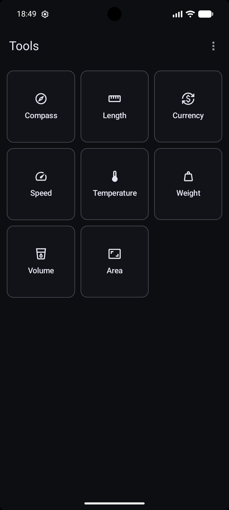
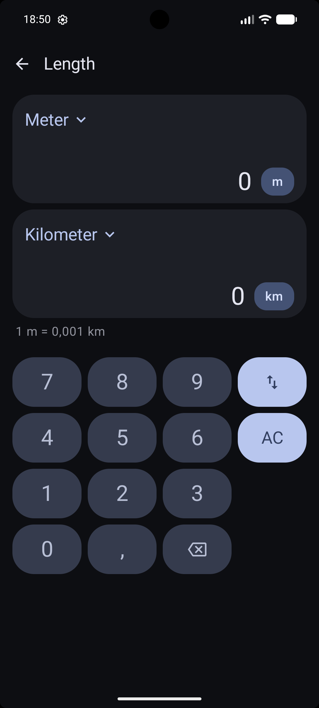
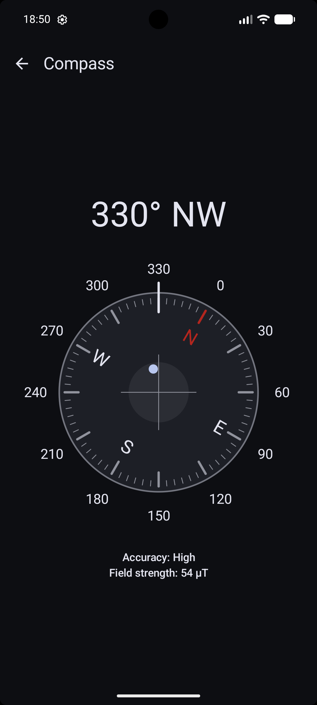

# Toolbox

[](https://github.com/devmatteini/android-toolbox/actions/workflows/ci.yml)


Toolbox is an Android app with the everyday tools you actually need in one place:

- Unit Converters – length, weight, volume, temperature, speed, and more
- Currency Converter – built-in exchange rates, with the option to download the latest rates on
  demand from the European Central Bank
- Compass – magnetic-north compass using your device's sensors

It works completely offline on your device.

[Languages](#languages) |
[Installation](#installation) |
[Contributing](#contributing)

<p>
  
  
  
</p>

## Languages

Toolbox is localized in 🇬🇧 English and 🇮🇹 Italian.

## Installation

Your device needs to run Android version 15+.

### Prebuilt APK

Download the prebuilt version of `Toolbox` from the
[latest release](https://github.com/devmatteini/android-toolbox/releases/latest).

### From source

```shell
git clone https://github.com/devmatteini/android-toolbox && cd android-toolbox
make release
file ./app/build/outputs/apk/release/app-release.apk
```

## Contributing

Read the [CONTRIBUTING.md](CONTRIBUTING.md) guidelines.
